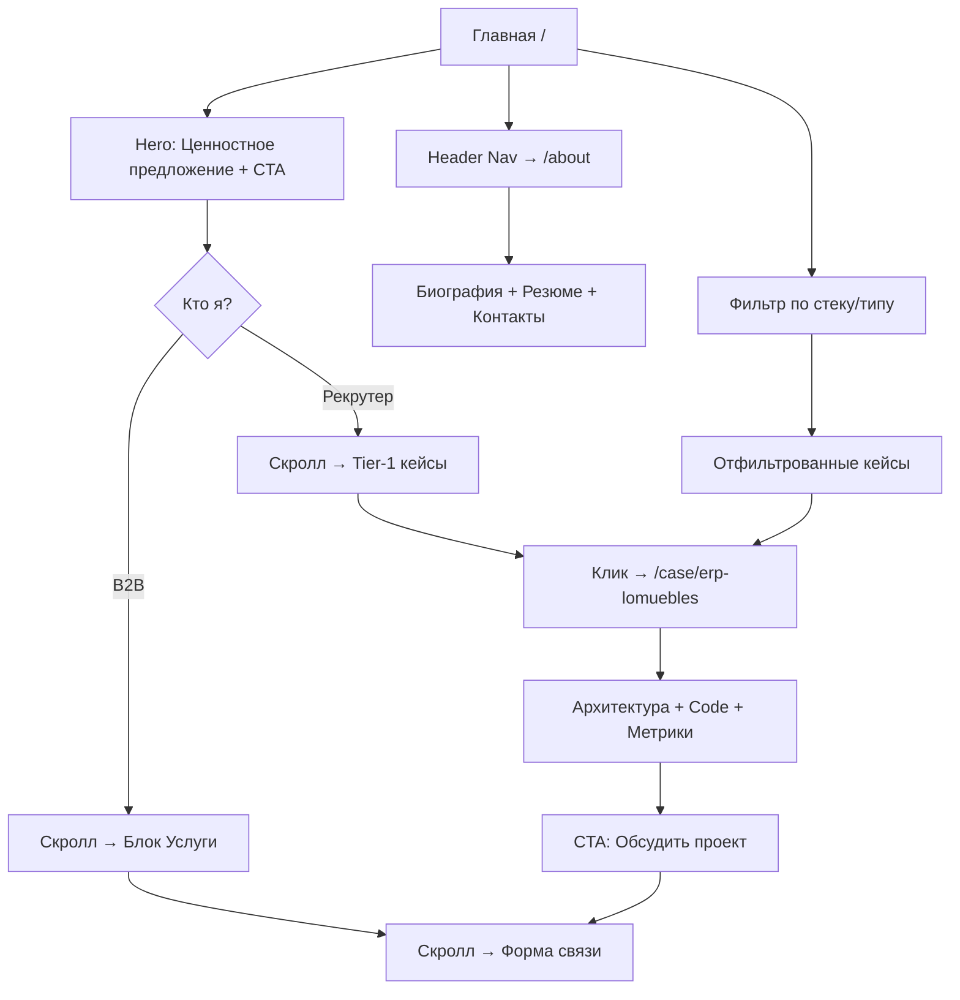

# 📋 PRD — Product Requirements Document
## Портфолио-сайт **Winsk.by**
### Full-Stack & AI Engineer | Independent Tech Expert

> **Версия:** 1.0  
> **Дата:** 26 февраля 2026  
> **Автор:** Product Manager  
> **Статус:** Draft → Review

---

## Оглавление

1. [Product Vision & Goals](#1-product-vision--goals)
2. [User Personas](#2-user-personas)
3. [Ключевые метрики успеха (KPIs)](#3-ключевые-метрики-успеха-kpis)
4. [Site Map & Information Architecture](#4-site-map--information-architecture)
5. [Core Features](#5-core-features)
6. [UX/UI & Branding Guidelines](#6-uxui--branding-guidelines)
7. [Контентная стратегия](#7-контентная-стратегия)
8. [Технические требования](#8-технические-требования)
9. [Roadmap и приоритеты](#9-roadmap-и-приоритеты)

---

# 1. Product Vision & Goals

## Коротко

**Winsk.by** — авторский сайт-портфолио, позиционирующий владельца как высокоуровневого независимого Tech-эксперта (Full-Stack & AI Engineer). Сайт одновременно выступает инструментом найма на позиции Lead/Senior в международные студии **и** лендингом для прямых B2B-заказчиков, которым нужна сложная разработка или AI-автоматизация.

## Семантика бренда

| Элемент | Значение |
|---------|----------|
| **Winsk** | Minsk → **W**insk: переворот буквы **M → W** как символ трансформации и победы (**Win**) |
| **Тэглайн** | *«Turning complexity into winning products»* |
| **Позиционирование** | Не «ещё один фрилансер», а **стратегический технический партнёр**, который проектирует и реализует сложные бизнес-системы от архитектуры до продакшена |

## Цели продукта

### A. Для аудитории «Рекрутер / Тимлид»

| # | Цель | Метрика достижения |
|---|------|--------------------|
| A1 | Продемонстрировать **глубину инженерного мышления** — не только код, но и архитектурные решения, обоснование trade-offs | Рекрутер после просмотра понимает уровень без необходимости тестового задания |
| A2 | Показать **разнообразие стека и продуктовый масштаб** (ERP, LMS, CRM, AI-экосистема) | Охват ≥3 бизнес-доменов в портфолио |
| A3 | Обеспечить быстрый доступ к **резюме, контактам, GitHub/LinkedIn** | Клик до контакта ≤ 2 шага с любой страницы |
| A4 | Сформировать образ **Lead-уровня**: ответственность за всю систему, не отдельные тикеты | Наличие архитектурных схем и описаний ролей на каждом кейсе |

### B. Для аудитории «B2B-заказчик»

| # | Цель | Метрика достижения |
|---|------|--------------------|
| B1 | Убедить, что автор **решает бизнес-задачи**, а не просто пишет код | Каждый кейс начинается с бизнес-проблемы и заканчивается метриками результата |
| B2 | Показать соответствие задаче заказчика через **фильтрацию кейсов по стеку/домену** | Заказчик за ≤30 сек находит релевантный кейс |
| B3 | Минимизировать трение до заявки: **CTA «Обсудить проект»** всегда в зоне видимости | CR landing → заявка ≥ 3% |
| B4 | Показать **AI/ML-компетенцию** как уникальный дифференциатор | Отдельный hero-блок AI-экосистемы на главной |

---

# 2. User Personas

---

## Persona 1: «Алексей» — Тимлид / Engineering Manager

```
Возраст:      32–42
Должность:    Engineering Manager / VP of Engineering
Компания:     Продуктовая IT-компания или аутсорс-студия (50–500 чел.)
Локация:      CIS, Европа, Remote-first
```

### Боли

- **Некогда разбираться в длинных резюме.** Хочет за 60 секунд понять: уровень, стек, масштаб задач.
- **Устал от «джунов, маскирующихся под сеньоров».** Ищет доказательства системного мышления: архитектурные диаграммы, обоснования решений, реальные продакшен-проекты.
- **Нужен T-shaped профиль.** Глубина в backend/AI **и** способность самостоятельно собрать фронтенд — это экономит найм двух человек.

### Ожидания от сайта

- Чистый, современный дизайн — первое впечатление формирует доверие к техническому вкусу.
- Быстрая навигация: стек → кейсы → контакт.
- Техническая глубина: фрагменты кода, архитектурные схемы, описание trade-offs.
- Мгновенный доступ к LinkedIn, GitHub, скачиваемому PDF-резюме.

### Сценарий использования

> Алексей получил ссылку на Winsk.by от HR. Открывает с телефона между встречами. За 90 секунд пролистывает главную, видит hero-кейс ERP с архитектурной диаграммой и метрикой «45+ таблиц в БД», кликает на AI-экосистему — впечатлён масштабом. Сохраняет себе ссылку и пишет в Telegram.

---

## Persona 2: «Марина» — CEO / Founder (B2B-заказчик)

```
Возраст:      28–50
Должность:    CEO, CPO, Founder
Компания:     МСБ (5–50 чел.), инфобизнес, e-commerce, сервисный бизнес
Локация:      СНГ, Испания, удалённо
```

### Боли

- **Обожглась на фрилансерах.** Прошлый подрядчик пропал в середине проекта. Ищет серьёзного исполнителя с продакшен-кейсами.
- **Не разбирается в технологиях.** Хочет видеть не стек, а бизнес-результаты: «ускорение обработки заказов», «автоматизация рутины», «рост конверсии».
- **Ограниченный бюджет → нужен один человек «от и до».** Full-Stack + понимание бизнес-процессов = идеал.
- **Интересуется AI-автоматизацией**, но не может сформулировать задачу — нужна консультация.

### Ожидания от сайта

- Понятный язык без лишнего жаргона; бизнес-кейсы с измеримыми результатами.
- Живые ссылки на работающие проекты (продакшен).
- Прозрачный путь до контакта: форма, Telegram, WhatsApp.
- Раздел «Услуги» или блок, объясняющий, в каких задачах автор может помочь.

### Сценарий использования

> Марина ищет разработчика CRM для своей клиники. Гуглит «crm для салона красоты разработка», попадает на Winsk.by. Видит кейс CRM «Я и Ты» — точно её ниша. Читает бизнес-задачу, видит метрику «реал-тайм уведомления в Telegram» и думает: «Мне нужно такое же». Кликает «Обсудить проект», заполняет форму.

---

# 3. Ключевые метрики успеха (KPIs)

| Категория | Метрика | Целевое значение |
|-----------|---------|------------------|
| **Трафик** | Среднемесячные уникальные визиты | 500+ за первые 3 мес. |
| **Вовлечённость** | Среднее время на сайте | ≥ 2 мин |
| **Вовлечённость** | Bounce Rate (главная) | ≤ 40% |
| **Конверсия** | CR «визит → контакт» | ≥ 3% |
| **Конверсия** | Кол-во заявок через форму / мес. | ≥ 5 |
| **Качество** | Lighthouse Score (Performance) | ≥ 90 |
| **Качество** | Lighthouse Score (SEO) | ≥ 95 |
| **Бренд** | Позиция в Google по запросу «Winsk» | Top 3 |

---

# 4. Site Map & Information Architecture

## Карта сайта (верхний уровень)

```
Winsk.by/
├── / (Главная страница)
│   ├── #hero — Hero-секция с ценностным предложением
│   ├── #projects — Витрина кейсов (Tier-1, Tier-2, Tier-3)
│   ├── #services — Блок «Что я делаю» (для B2B)
│   ├── #stack — Технологический стек
│   └── #contact — CTA + форма связи
│
├── /case/:slug (Детальная страница кейса)
│   ├── Hero с ключевым скриншотом
│   ├── Бизнес-задача и контекст
│   ├── Техническая реализация (таблица решений)
│   ├── Архитектурная схема
│   ├── Скриншоты / Карусель
│   ├── Стек и метрики
│   └── CTA «Обсудить аналогичный проект»
│
├── /about (Обо мне / Контакты)
│   ├── Биография и опыт
│   ├── Услуги и специализация
│   ├── Контактная форма
│   ├── Социальные ссылки (LinkedIn, GitHub, Telegram)
│   └── Скачиваемое PDF-резюме
│
└── (Системные)
    ├── /404 — Кастомная страница ошибки
    └── sitemap.xml, robots.txt
```

## Информационная архитектура: потоки навигации



---

## Детализация страниц

### 4.1. Главная страница `/`

Главная — это «продающий лендинг» и одновременно «витрина экспертизы». Структура спроектирована для скроллинга сверху вниз с нарастанием глубины.

| Секция | Контент | Назначение |
|--------|---------|------------|
| **Hero** | Имя / Тэглайн / Анимированный брендинг «W» / CTA: «Смотреть проекты» + «Связаться» | Первое впечатление за 3 секунды: кто, что, зачем |
| **Showreel / Интро** | Короткий видео-шоурил (15–30 сек) или анимированная инфографика ключевых метрик | Wow-фактор, удержание внимания |
| **Tier-1: Enterprise** | 3 карточки (LMS, ERP, CRM) — каждая с hero-скриншоте, бизнес-метрикой, стек-бейджами | Доказательство масштаба и глубины |
| **Tier-2: AI Ecosystem** | Один крупный блок с архитектурным пайплайном, мини-диаграммой 📊→🔍→🎨→👁→📦→💰 | Уникальный дифференциатор — AI-экспертиза |
| **Tier-3: Websites** | Компактный ряд из 2 bento-карточек (LOMuebles, Prozub.by) | Подтверждение конверсионной коммерческой компетенции |
| **Услуги** | 3–4 карточки: «Разработка SaaS», «AI-автоматизация», «CRM/ERP под ключ», «Консалтинг» | Конвертация B2B-аудитории |
| **Стек** | Интерактивная сетка иконок технологий с группировкой по слоям (Backend, Frontend, AI, DevOps) | Быстрая оценка стека для рекрутера |
| **Контакт-секция** | Форма (имя, email/Telegram, описание задачи) + прямые ссылки на мессенджеры | Минимальное трение до заявки |

### 4.2. Детальная страница кейса `/case/:slug`

Шаблонная страница, единая для всех проектов, но с вариативными секциями (опциональные блоки показываются по наличию контента).

| Секция | Описание | Обязательность |
|--------|----------|----------------|
| **Hero** | Полноэкранный скриншот/мокап + заголовок + роль + тэглайн кейса | ✅ |
| **Бизнес-задача** | 2–3 абзаца: что было до → какая боль → что нужно было решить | ✅ |
| **Решения (таблица)** | Задача → Решение → Почему это сложно (формат из контентной базы) | ✅ |
| **Архитектурная схема** | Mermaid-диаграмма или SVG: компоненты системы и их связи | ✅ (Tier-1, Tier-2) |
| **Карусель скриншотов** | 4–8 экранов: дашборды, мобильная версия, админ-панели | ✅ |
| **Фрагменты кода** | 2–3 сниппета с подсветкой синтаксиса и комментариями | ⭕ Опция (Tier-1, Tier-2) |
| **Метрики-бейджы** | 3 ключевые цифры крупным шрифтом в стилизованных карточках | ✅ |
| **Tech Stack** | Горизонтальный ряд иконок с тултипами | ✅ |
| **До/После** | Сравнение (Before/After slider для веб-сайтов) | ⭕ Опция (Tier-3) |
| **Видео-демо** | Встроенный screencast | ⭕ Опция |
| **Ссылка на прод/GitHub** | Кликабельные кнопки | ✅ (при наличии) |
| **Навигация** | ← Предыдущий кейс / Следующий кейс → | ✅ |
| **CTA** | «Нужен аналогичный проект? Давайте обсудим» + форма/ссылка | ✅ |

### 4.3. Страница «Обо мне / Контакты» `/about`

| Секция | Описание |
|--------|----------|
| **Фото + Bio** | Профессиональное фото, краткая биография (3–5 предложений), ключевые факты: стаж, стек, география |
| **Карьерный таймлайн** | Интерактивная вертикальная шкала: ключевые проекты, роли, технологии по годам |
| **Услуги** | Детализированный список: что делаю, для кого, в каком формате (аутстаф, проектная разработка, консалтинг) |
| **Резюме** | Кнопка «Скачать PDF» (всегда актуальная версия) |
| **Контактная форма** | Имя, Email / Telegram, тип запроса (найм / проект / консультация), сообщение |
| **Социальные ссылки** | GitHub, LinkedIn, Telegram — с иконками |
| **Карта** | Минск на стилизованной карте (опционально, для локального SEO) |

---

# 5. Core Features

## 5.1. MVP-фичи (запуск)

| # | Фича | Подробности | Приоритет |
|---|------|-------------|-----------|
| F1 | **Фильтрация кейсов** | По стеку (Python, React, AI/ML, Vue, etc.) и по типу (SaaS, Bot, Website, Desktop). Состояние фильтров сохраняется в URL (query params) | 🔴 Must |
| F2 | **Terminal Decode: анимация Minsk → Winsk** | Брендинговая анимация в hero: имитация терминала, текст `> Location: Minsk` через glitch/scrambling text (посимвольная рандомизация) за 1.5 сек превращается в `> Status: Winsk_`. Моноширинный шрифт, мерцающий курсор, scanline-эффект | 🔴 Must |
| F3 | **Интерактивный шоурил** | Автозапускаемая немая видео-презентация (WebM/MP4) или Lottie-анимация ключевых интерфейсов на hero-секции. Управление: play/pause при hover | 🔴 Must |
| F4 | **Контактная форма** | Валидация на клиенте + отправка через API (Telegram Bot / Email). Подтверждение «Ваша заявка принята» | 🔴 Must |
| F5 | **Адаптивный дизайн** | Mobile-first. Breakpoints: 375px / 768px / 1024px / 1440px. Touch-оптимизация | 🔴 Must |
| F6 | **SEO-оптимизация** | SSR/SSG, мета-теги, OG-теги для каждой страницы, `sitemap.xml`, `robots.txt`, schema.org (Person, CreativeWork) | 🔴 Must |
| F7 | **Анимации скролла** | Scroll-triggered reveal (Intersection Observer): карточки, метрики, стек-бейджи появляются с fade-in | 🟡 Should |
| F8 | **Доступное PDF-резюме** | Ссылка на скачивание актуального CV в формате PDF | 🔴 Must |

> **Forced Dark Mode:** Сайт работает исключительно в тёмной теме. Переключатель тем не предусмотрен — эстетика Cyberpunk / Terminal требует тёмного фона.

## 5.2. Фичи v2 (пост-запуск)

| # | Фича | Подробности | Приоритет |
|---|------|-------------|-----------|
| F9 | **Мультиязычность (RU/EN)** | i18n с переключателем. Русский — основной, английский — для международной аудитории | 🟡 Should |
| F10 | **Блог / Статьи** | Markdown-based блог для SEO-трафика. Темы: AI-кейсы, архитектурные решения, code review | 🟢 Could |
| F11 | **Аналитика** | Плитка с дашбордом: Yandex.Metrika / GA4 / Plausible (lightweight, GDPR-compliant) | 🟡 Should |
| F12 | **Интерактивная архитектурная схема** | Кликабельная SVG/Canvas карта AI-экосистемы (Tier-2): при клике на компонент раскрываются детали | 🟢 Could |
| F13 | **Before/After слайдер** | Для Tier-3 кейсов: перетаскиваемый разделитель между двумя скриншотами | 🟢 Could |

---

# 6. UX/UI & Branding Guidelines

---

## 6.1. Концепция бренда «Winsk»

### Центральная метафора: Terminal Decode

Бренд строится на эстетике **Cyberpunk / Tech Lead**. Ключевой визуальный приём — **имитация работы терминала с glitch-эффектом**: текст `> Location: Minsk` проходит через цифровой распад (scrambling) и пересобирается в `> Status: Winsk_`. Это не просто анимация — это **манифест**: город → бренд, код → продукт, хаос → порядок.

### Обыгрывание Terminal Decode на всех уровнях

| Уровень | Реализация |
|---------|------------|
| **Логотип** | Глиф «W» в моноширинном инженерном шрифте (JetBrains Mono / Fira Code). Стилизация под символ терминального промпта. При повороте на 180° читается «M» (Minsk) — скрытый easter egg |
| **Hero-анимация** | Имитация терминала на тёмном фоне. Печатается строка `> Location: Minsk` (эффект typewriter, 40ms/символ). Затем — цифровой глитч: символы хаотично распадаются на случайные знаки (`#`, `@`, `%`, `█`, `▓`, `░`), пробегают 3–5 итераций scrambling, и строка пересобирается в `> Status: Winsk_` с мигающим курсором. Общая длительность: 2.5–3 сек. Под строкой — тонкий зелёный scanline-sweep |
| **Favicon** | «W» в форме терминального промпта: `>W` или стилизованный глиф с accent-цветом |
| **Loading screen** | Три строки терминала, появляющиеся последовательно: `> booting winsk.by...` → `> loading modules... [████████] 100%` → `> ready_`. Моноширинный шрифт, зелёные/фиолетовые акценты на тёмном фоне |
| **404 страница** | Терминальная эстетика: `> ERROR 404: page_not_found` → глитч-эффект → `> Кажется, этот маршрут ещё не задеплоен 🤖` → кнопка `> cd /home` вместо «На главную» |
| **Hover-эффект на лого** | При наведении на «W» в навигации — micro-glitch: буква дрожит 2–3 раза (CSS `translate` + `opacity` flicker, 200ms), имитируя цифровые помехи |
| **OG-картинка** | Тёмный фон (#0A0E1A), строка терминала `> Status: Winsk_` с мигающим курсором и scanline-полосами. Под строкой — тэглайн Inter SemiBold. Фиолетовое свечение вокруг текста |

### Механика Scrambling Text (техническая спецификация)

```
Фаза 1: TYPEWRITER (0.8 сек)
─────────────────────────────────────────────────────
> Location: Minsk
  ↑ посимвольное появление, 40ms/символ
  Шрифт: JetBrains Mono, цвет: #10B981 (Emerald)
  Мигающий block-курсор: █

Фаза 2: GLITCH HOLD (0.3 сек)
─────────────────────────────────────────────────────
> Location: Minsk█
  ↑ пауза, строка целиком видна
  Экран: 1-2 горизонтальных glitch-полосы
  (CSS clip-path + translate + hue-rotate)

Фаза 3: SCRAMBLE DECODE (1.2 сек)
─────────────────────────────────────────────────────
> L#c@t!0n: M!n$k   → итерация 1 (случайные символы)
> $t@%u$: W!n#k     → итерация 2 (буквы начинают «встать на место»)
> St@tus: Wińsk     → итерация 3
> Status: Winsk     → итерация 4 (финальная расстановка)

  Принцип: каждая буква «решается» слева направо.
  Нерешённые позиции: случайные ASCII из набора
  [#, @, %, !, $, &, *, █, ▓, ░, 0-9]
  Интервал между итерациями: 30–50ms.
  Решённые буквы фиксируются и больше не меняются.

Фаза 4: RESOLVE (0.2 сек)
─────────────────────────────────────────────────────
> Status: Winsk_
  ↑ Финальное состояние.
  Курсор мигает бесконечно (CSS @keyframes blink).
  Тонкий scanline-sweep проходит по строке сверху вниз.
  Цвет переключается: Emerald → Electric Violet (#7C3AED)
```

### Глобальная эстетика «Terminal DNA»

Стилистика терминала должна **пронизывать весь сайт** как рекуррентный мотив — не перегружая, а создавая ощущение «сайта, который написал инженер»:

| Элемент | Терминальный штрих |
|---------|--------------------|
| **Заголовки секций** | Prefix `>` перед заголовками секций, отрисованный на `::before` в accent-цвете. Например: `> Проекты` |
| **Метрики-бейджи** | Стилизация под вывод терминала: `output: 45+ tables`, моноширинный шрифт |
| **Стек-бейджи** | Выглядят как теги в `package.json`: `"react": "^18"`, `"python": "3.12"` |
| **Разделители секций** | Горизонтальная линия из символов: `─────────────────────` или `═══════════════════` |
| **Hover на кнопках** | Micro-glitch (1-2 кадра дрожания) перед стандартным hover-эффектом |
| **Скролл-индикатор** | Вертикальная полоска прогресса стилизована под progress bar: `[████░░░░] 42%` |

### Тональность коммуникации

| Контекст | Тон |
|----------|-----|
| **Hero, заголовки** | Уверенный, краткий, с привкусом CLI-эстетики. «Инженер, который говорит продуктами, а не словами» |
| **Описания кейсов** | Профессиональный, но понятный. Первый абзац — для бизнеса, таблицы — для техлидов |
| **CTA** | Дружелюбный, приглашающий. «Давайте обсудим вашу задачу» вместо «Заказать сейчас» |
| **Ошибки/пустые состояния** | Терминальный юмор: `> sudo find project --type awesome`, `> 404: route not deployed yet` |

---

## 6.2. Цветовая палитра

Палитра построена на сочетании **технологичности** (тёмные нейтральные тона, холодный контраст) и **премиальности** (акцентное свечение, градиенты).

> **Forced Dark Mode.** Светлая тема не предусмотрена. Все цвета оптимизированы для тёмного фона.

### Цветовая палитра (Dark Mode)

| Роль | Цвет | HEX | HSL | Назначение |
|------|-------|-----|-----|------------|
| **Background Primary** | Deep Navy | `#0A0E1A` | `228° 40% 7%` | Основной фон страницы |
| **Background Secondary** | Dark Slate | `#111827` | `221° 39% 11%` | Карточки, секции |
| **Background Elevated** | Midnight | `#1E293B` | `217° 33% 17%` | Модалки, dropdown, hover-состояния |
| **Surface Glass** | Frosted | `rgba(255,255,255, 0.05)` | — | Glassmorphism-элементы |
| **Text Primary** | Snow | `#F8FAFC` | `210° 40% 98%` | Заголовки, основной текст |
| **Text Secondary** | Cool Gray | `#94A3B8` | `215° 20% 65%` | Подписи, мета-информация |
| **Accent Primary** | Electric Violet | `#7C3AED` | `263° 83% 58%` | CTA, активные ссылки, выделения |
| **Accent Glow** | Violet Glow | `#A78BFA` | `255° 92% 76%` | Hover-состояния, свечение |
| **Accent Gradient** | Tech Gradient | `linear-gradient(135deg, #7C3AED, #2563EB)` | — | Hero-фон, ключевые элементы |
| **Success** | Emerald | `#10B981` | `160° 84% 39%` | Метрики, «продакшен» бейджи |
| **Border** | Subtle Edge | `rgba(148, 163, 184, 0.12)` | — | Разделители, обводки карточек |


### Градиенты и свечение

```css
/* Hero gradient overlay */
--gradient-hero: linear-gradient(135deg, rgba(124,58,237,0.15), rgba(37,99,235,0.10));

/* Card glow on hover (Tier-2 AI) */
--glow-ai: 0 0 40px rgba(124,58,237,0.25), 0 0 80px rgba(37,99,235,0.15);

/* Glassmorphism card */
--glass: background: rgba(255,255,255,0.05);
         backdrop-filter: blur(12px);
         border: 1px solid rgba(255,255,255,0.08);
```

---

## 6.3. Типографика

| Элемент | Шрифт | Вес | Размер (desktop) | Назначение |
|---------|-------|-----|-------------------|------------|
| **H1 (Hero)** | **Inter** или **Outfit** | 800 (ExtraBold) | 56–72px | Главный заголовок |
| **H2 (секции)** | Inter | 700 (Bold) | 36–42px | Заголовки секций |
| **H3 (кейсы)** | Inter | 600 (SemiBold) | 24–28px | Названия проектов |
| **Body** | Inter | 400 (Regular) | 16–18px | Основной текст |
| **Code** | **JetBrains Mono** | 400 | 14–15px | Сниппеты кода, стек-бейджи |
| **Caption** | Inter | 400 | 13–14px | Подписи, мета-данные |

> **Letter-spacing:** -0.02em для заголовков (уплотнённый, премиальный), 0 для body
> **Line-height:** 1.2 для H1, 1.6 для body

---

## 6.4. Визуальный язык по тирам

### Tier-1: Enterprise & SaaS

| Параметр | Значение |
|----------|----------|
| **Стиль** | Сдержанный корпоративный. Тёмные тона, чёткая типографика, минимум декора |
| **Фон карточки** | Dark Slate `#111827` с тонкой border |
| **Акцент** | Холодный фиолетово-синий градиент |
| **Hero-скриншот** | Полупрозрачный скриншот интерфейса на фоне |
| **Метрики** | Крупные цифры в стилизованных карточках с лёгким glow |

### Tier-2: AI Ecosystem

| Параметр | Значение |
|----------|----------|
| **Стиль** | Футуристичный, киберпанк-акценты. Glassmorphism, неоновые свечения |
| **Фон карточки** | Glassmorphism: frosted glass + фиолетовый gradient border |
| **Акцент** | Неоновый фиолетовый с электрическим свечением |
| **Анимация** | Бегущие линии связей на схеме, пульсирующие точки, эффект «живой системы» |
| **Pipeline** | Горизонтальная цепочка: 📊→🔍→🎨→👁→📦→💰 с анимацией пошагового highlight |

### Tier-3: Commercial Websites

| Параметр | Значение |
|----------|----------|
| **Стиль** | Чистый, минималистичный, Bento box UI |
| **Фон карточки** | Чуть светлее основного фона (elevated surface) |
| **Акцент** | Сдержанный, минимальные градиенты |
| **Мокапы** | Изометрические мокапы устройств (MacBook + iPhone) с реальными скриншотами сайтов |

---

## 6.5. Компоненты UI

### Карточка проекта (главная)

```
┌────────────────────────────────────────────────┐
│  [Скриншот / полупрозрачный фон]               │
│                                                │
│  🏭 ERP «LOMuebles»                           │
│  Система управления мебельным производством    │
│                                                │
│  ┌──────┐ ┌──────┐ ┌──────┐                    │
│  │5 мод.│ │ RLS  │ │45+   │ ← метрики-бейджи  │
│  │      │ │      │ │таблиц│                    │
│  └──────┘ └──────┘ └──────┘                    │
│                                                │
│  [React] [TypeScript] [Supabase] [PostgreSQL]  │
│                                                │
│                        Подробнее →             │
└────────────────────────────────────────────────┘
```

### Навигация

```
┌──────────────────────────────────────────────────────────┐
│  [W] Winsk    Проекты   Обо мне   [RU|EN]   📄           │
│                                                          │
│  Логотип     Якорные    About     Язык     CV            │
│  (с hover-   ссылки     link               Download      │
│   анимацией)                                             │
└──────────────────────────────────────────────────────────┘
```

### CTA-блок

```
┌──────────────────────────────────────────────────────────┐
│                                                          │
│     Нужна сложная разработка или AI-автоматизация?       │
│                                                          │
│     Расскажите о задаче — обсудим решение                │
│                                                          │
│     ┌──────────────────────────────────────────────┐     │
│     │          Обсудить проект →                   │     │
│     └──────────────────────────────────────────────┘     │
│                                                          │
│     или напишите в Telegram: @username                   │
│                                                          │
└──────────────────────────────────────────────────────────┘
```

---

## 6.6. Микро-взаимодействия и анимации

### Терминальные и глитч-анимации (ядро бренда)

| Элемент | Анимация | Детали |
|---------|----------|--------|
| **Hero: Terminal Decode** | Typewriter → Glitch → Scramble → Resolve | `> Location: Minsk` → glitch-распад → scrambling (30ms/итерация, 4–6 циклов) → `> Status: Winsk_`. Общая длительность: 2.5–3 сек. Моноширинный шрифт JetBrains Mono. Scanline-sweep на финале |
| **Курсор терминала** | Infinite blink | Block-курсор `█`, CSS `@keyframes blink { 0%,50% { opacity:1 } 51%,100% { opacity:0 } }`, 800ms |
| **Glitch-полосы (Hero)** | Кратковременные горизонтальные артефакты | CSS `clip-path: inset()` + `translateX(±3px)` + `hue-rotate(90deg)`, 2–3 полосы, 50–100ms на появление |
| **Лого «W»** | Hover → micro-glitch | 2–3 быстрых дрожания: `translateX(±2px)` + `opacity` flicker (0.8→1→0.9→1), 200ms total. Не rotation, а цифровая помеха |
| **Scanline** | Периодический sweep | Полупрозрачная горизонтальная полоса (`rgba(124,58,237,0.07)`, height: 2px) медленно ползёт сверху вниз по hero-секции. `animation: scanline 4s linear infinite` |

### UI-анимации (общие)

| Элемент | Анимация | Детали |
|---------|----------|--------|
| **Карточки** | Scroll reveal | Intersection Observer, fade-in + translateY(20px), stagger 100ms |
| **Карточки hover** | Lift + glow + micro-glitch | `translateY(-4px)`, `box-shadow: glow`, 200ms. На Tier-2 карточках — дополнительный 1-кадровый glitch-мерцание border |
| **Метрики** | Count-up | Числа анимировано «нарастают» при scroll-in. Моноширинный шрифт, стилизация под терминальный `output:` |

| **Pipeline (Tier-2)** | Sequential highlight | Каждый шаг подсвечивается волной: 📊→🔍→🎨→👁→📦→💰 (loop). Зелёная «бегущая точка» между шагами |
| **Кнопки CTA** | Hover: scale + micro-glitch | `transform: scale(1.03)` + 1-кадровый glitch-flicker текста (имитация помехи). На mobile: стандартный scale без glitch |
| **Ссылки** | Underline reveal | Подчёркивание «вырастает» слева направо при hover |
| **Заголовки секций** | Появление prompt-символа | `>` появляется с opacity 0→1 и translateX(-10px→0) за 300ms при scroll-in |
| **Page transition** | Glitch-wipe | При переходе между страницами — кратковременный (200ms) glitch-эффект: 3–4 горизонтальные полосы смещаются, затем новая страница «собирается» |

---

# 7. Контентная стратегия

## Источник контента

Вся фактическая база берётся из документа [master-claude-portfolio.md](file:///d:/Portfolio/Docs/master-claude-portfolio.md):

| Тир | Проекты | Статус контента |
|-----|---------|-----------------|
| **Tier-1** | LMS «Lucy Nails», ERP «LOMuebles», CRM «Я и Ты» | ✅ Полные кейсы (бизнес-задача, таблица решений, стек, метрики) |
| **Tier-2** | Экосистема AI-автоматизации (6 компонентов) | ✅ Детальная архитектура, pipeline, инженерные решения |
| **Tier-3** | Сайт LOMuebles, Prozub.by | ✅ Кейсы с техническими деталями |

## Контент, который нужно подготовить дополнительно

| Элемент | Описание | Формат |
|---------|----------|--------|
| **Скриншоты** | 4–8 скриншотов каждого проекта (дашборды, мобильная версия, админки) | PNG/WebP, ≥1200px по длинной стороне |
| **Архитектурные схемы** | Mermaid или SVG для каждого Tier-1 и Tier-2 проекта | Mermaid → SSR или SVG |
| **Шоурил** | Видео 15–30 сек: нарезка интерфейсов, скроллинг, анимации | WebM/MP4, ≤5 MB |
| **Фото автора** | Профессиональное фото для страницы About | JPEG/WebP, 800×800+ |
| **CV (PDF)** | Актуальное резюме в формате PDF | A4, ≤2 стр. |
| **OG-картинки** | Уникальная для каждой страницы (главная + каждый кейс) | 1200×630 PNG |
| **Фрагменты кода** | 2–3 сниппета на каждый Tier-1/2 проект | Markdown code blocks |

---

# 8. Технические требования

## Рекомендуемый стек

| Слой | Технология | Обоснование |
|------|------------|-------------|
| **Framework** | **Next.js 14+** (App Router) | SSG для скорости, SSR для SEO, Image Optimization из коробки |
| **Стилизация** | **Tailwind CSS** + CSS Custom Properties | Утилитарный подход + темизация через CSS variables |
| **Анимации** | **Framer Motion** или **GSAP** | Scroll-triggered анимации, page transitions, micro-interactions |
| **Шоурил** | HTML5 `<video>` с lazy loading | Автовоспроизведение без звука, progressive enhancement |
| **Формы** | React Hook Form + API Route (Next.js) → Telegram Bot API | Валидация + отправка заявки в Telegram |
| **CMS (опция v2)** | **MDX** или **Contentlayer** | Markdown-based контент, Git как CMS |
| **Хостинг** | **Vercel** | Zero-config деплой Next.js, Edge CDN, бесплатный SSL |
| **Аналитика** | **Plausible** или **Yandex.Metrika** | Лёгкий скрипт, GDPR-friendly |
| **Домен** | **Winsk.by** | Белорусская зона, локальный SEO-бонус |

## Требования к производительности

| Метрика | Целевое значение |
|---------|------------------|
| Lighthouse Performance | ≥ 90 |
| Lighthouse SEO | ≥ 95 |
| Lighthouse Accessibility | ≥ 90 |
| First Contentful Paint | ≤ 1.5 сек |
| Largest Contentful Paint | ≤ 2.5 сек |
| Cumulative Layout Shift | ≤ 0.1 |
| Общий вес страницы (главная) | ≤ 2 MB (без видео) |
| Time to Interactive | ≤ 3.5 сек |

## Требования к SEO

- SSG/SSR с полной гидратацией мета-тегов.
- Уникальные `title`, `description`, OG-теги на каждой странице.
- Структурированные данные: `schema.org/Person`, `schema.org/CreativeWork` для кейсов.
- `sitemap.xml` генерируется автоматически.
- Канонические URL, `hreflang` для мультиязычности (v2).
- Чистые URL без trailing slash: `/case/erp-lomuebles`.

---

# 9. Roadmap и приоритеты

## Фаза 1: MVP (2–3 недели)

| Задача | Приоритет |
|--------|-----------|
| Настройка проекта (Next.js, Tailwind, деплой на Vercel) | 🔴 |
| Дизайн-система: цвета, шрифты, компоненты (карточки, кнопки, навигация) | 🔴 |
| Terminal Decode (Minsk → Winsk) + глитч-эффекты | 🔴 |
| Главная страница (Hero + Тизеры кейсов + Стек + CTA) | 🔴 |
| Шаблон детальной страницы кейса | 🔴 |
| Наполнение: все 6 кейсов (Tier-1, Tier-2, Tier-3) | 🔴 |
| Страница About / Контакты | 🔴 |
| Контактная форма → Telegram Bot | 🔴 |
| Фильтрация кейсов по стеку и типу | 🔴 |
| SEO: мета-теги, OG, sitemap, schema.org | 🔴 |
| Адаптив (mobile/tablet) | 🔴 |
| Lighthouse оптимизация | 🟡 |

## Фаза 2: Polish (1–2 недели)

| Задача | Приоритет |
|--------|-----------|
| Шоурил / Видео-интро | 🟡 |
| Scroll-анимации (Framer Motion) | 🟡 |
| Count-up метрик | 🟡 |
| Before/After слайдер (Tier-3) | 🟢 |
| Интерактивная архитектурная схема (Tier-2) | 🟢 |
| 404 страница с брендингом | 🟡 |

## Фаза 3: Growth (ongoing)

| Задача | Приоритет |
|--------|-----------|
| Мультиязычность (RU/EN) | 🟡 |
| Блог / Статьи (MDX) | 🟢 |
| Интеграция аналитики | 🟡 |
| A/B тестирование CTA | 🟢 |
| Новые кейсы и обновление контента | 🟡 |

---

> **Документ готов к ревью.** После утверждения PRD следующий шаг — создание дизайн-макета (Figma / код) и детального технического задания на реализацию.
