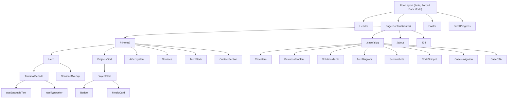
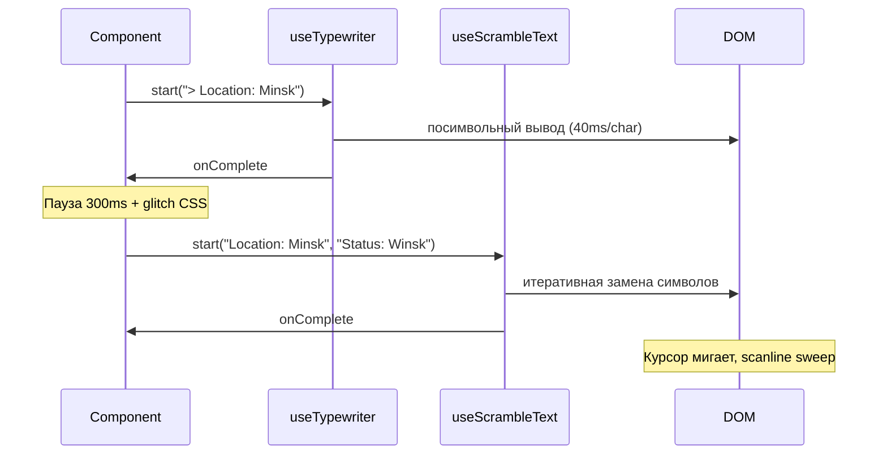

# 🔧 Technical Specification — Winsk.by
## Full-Stack & AI Engineer Portfolio

> **Версия:** 1.0  
> **Дата:** 26 февраля 2026  
> **Роль автора:** Tech Lead / Software Architect  
> **Основан на:** [PRD-Winsk-by.md](file:///d:/Portfolio/Docs/PRD-Winsk-by.md)

---

## Оглавление

1. [Tech Stack](#1-tech-stack)
2. [Project Architecture](#2-project-architecture)
3. [Data Management](#3-data-management)
4. [Animation Specifications](#4-animation-specifications)
5. [Performance & SEO Requirements](#5-performance--seo-requirements)
6. [Design System Tokens](#6-design-system-tokens)
7. [Deployment & CI/CD](#7-deployment--cicd)

---

# 1. Tech Stack

## 1.1. Обоснование выбора

| Критерий | Требование (из PRD) | Решение |
|----------|---------------------|---------|
| SEO / SSR | Lighthouse SEO ≥ 95, полная гидратация мета-тегов | **Next.js 15 (App Router)** — SSG по умолчанию, ISR при необходимости |
| Скорость разработки | MVP за 2–3 недели | **Tailwind CSS v4** — utility-first, без написания кастомных CSS-файлов |
| Анимации | Terminal Decode, glitch, scrambling text, scroll-reveal | **Framer Motion 11** (scroll + layout) + **кастомный хук `useScrambleText`** |
| Типизация | Надёжность, автодокументация | **TypeScript 5.x** strict mode |
| Контент | Markdown-based кейсы, Git как CMS | **MDX 3** + **next-mdx-remote** |
| Производительность | LCP ≤ 2.5s, CLS ≤ 0.1 | Next.js Image Optimization, font `display: swap` |
| Хостинг | Zero-config, Edge CDN, SSL | **Vercel** (бесплатный план покрывает трафик портфолио) |

## 1.2. Полный список зависимостей

### Production

```jsonc
{
  "dependencies": {
    "next": "^15.0",
    "react": "^19.0",
    "react-dom": "^19.0",
    "framer-motion": "^11.0",       // scroll-анимации, layout transitions, page transitions
    "next-mdx-remote": "^5.0",      // рендеринг MDX-контента на сервере
    "react-hook-form": "^7.50",     // формы (контакт)
    "zod": "^3.22",                 // валидация форм
    "@vercel/analytics": "^1.0",    // аналитика
    "sharp": "^0.33"                // оптимизация изображений на сервере
  }
}
```

### Development

```jsonc
{
  "devDependencies": {
    "typescript": "^5.6",
    "tailwindcss": "^4.0",
    "@tailwindcss/typography": "^0.5",  // prose-классы для MDX-контента
    "eslint": "^9.0",
    "eslint-config-next": "^15.0",
    "prettier": "^3.0",
    "prettier-plugin-tailwindcss": "^0.6"
  }
}
```

### Шрифты (self-hosted через `next/font`)

```typescript
// src/lib/fonts.ts
import { Inter, JetBrains_Mono } from 'next/font/google';

export const inter = Inter({
  subsets: ['latin', 'cyrillic'],
  variable: '--font-inter',
  display: 'swap',
});

export const jetbrainsMono = JetBrains_Mono({
  subsets: ['latin', 'cyrillic'],
  variable: '--font-mono',
  display: 'swap',
  weight: ['400', '700'],
});
```

## 1.3. Обоснование отклонённых альтернатив

| Альтернатива | Почему отклонена |
|-------------|------------------|
| **Astro** | Отличный SSG, но экосистема React-компонентов беднее; Framer Motion не работает нативно |
| **GSAP** | Мощнее Framer Motion для timeline-анимаций, но тяжелее (~30KB), коммерческая лицензия для ScrollTrigger, overkill для портфолио |
| **Gatsby** | Устаревший DX, медленные билды, проигрывает Next.js по экосистеме |
| **Vanilla CSS** | Недостаточная скорость разработки для MVP за 2–3 недели; Tailwind экономит ~40% времени на стилизацию |
| **Contentful / Sanity** | Избыточно для 6 кейсов; MDX даёт Git-versioning бесплатно и zero-latency |

---

# 2. Project Architecture

## 2.1. Структура папок

```
winsk.by/
├── public/
│   ├── fonts/                    # Fallback шрифты (если не Google Fonts)
│   ├── images/
│   │   ├── projects/             # Скриншоты кейсов
│   │   │   ├── lms-lucy-nails/
│   │   │   ├── erp-lomuebles/
│   │   │   ├── crm-ya-i-ty/
│   │   │   ├── ai-ecosystem/
│   │   │   ├── site-lomuebles/
│   │   │   └── prozub-by/
│   │   ├── og/                   # OG-картинки (1200×630)
│   │   └── misc/                 # Фото автора, логотип, favicon
│   ├── videos/                   # Шоурил, демо
│   ├── cv.pdf                    # Скачиваемое резюме
│   ├── robots.txt
│   └── sitemap.xml               # Генерируется Next.js
│
├── src/
│   ├── app/                      # Next.js App Router
│   │   ├── layout.tsx            # Root layout: шрифты, Forced Dark Mode, навигация
│   │   ├── page.tsx              # Главная страница
│   │   ├── globals.css           # Tailwind directives + CSS custom properties
│   │   ├── case/
│   │   │   └── [slug]/
│   │   │       └── page.tsx      # Динамическая страница кейса (SSG)
│   │   ├── about/
│   │   │   └── page.tsx          # Обо мне / Контакты
│   │   ├── not-found.tsx         # Кастомная 404 (терминальная эстетика)
│   │   └── api/
│   │       └── contact/
│   │           └── route.ts      # API: отправка формы → Telegram Bot
│   │
│   ├── components/
│   │   ├── layout/               # Структурные компоненты
│   │   │   ├── Header.tsx        # Навигация + лого (micro-glitch hover)
│   │   │   ├── Footer.tsx
│   │   │   ├── Section.tsx       # Обёртка секции с `>` prefix и ID
│   │   │   └── Container.tsx     # Max-width контейнер
│   │   │
│   │   ├── ui/                   # UI-kit (атомарные компоненты)
│   │   │   ├── Button.tsx        # CTA кнопка с micro-glitch hover
│   │   │   ├── Badge.tsx         # Стек-бейдж ("react": "^18")
│   │   │   ├── MetricCard.tsx    # Метрика в стиле output:
│   │   │   ├── Card.tsx          # Базовая карточка
│   │   │   ├── GlassCard.tsx     # Glassmorphism (Tier-2)
│   │   │   ├── BentoCard.tsx     # Bento box (Tier-3)
│   │   │   ├── Divider.tsx       # ─────── разделитель
│   │   │   ├── ScrollProgress.tsx # [████░░░░] 42%
│   │   │   └── TerminalBlock.tsx # Стилизованный блок кода/терминала
│   │   │
│   │   ├── sections/             # Секции главной страницы
│   │   │   ├── Hero.tsx          # Hero + Terminal Decode анимация
│   │   │   ├── ProjectsGrid.tsx  # Витрина кейсов с фильтрацией
│   │   │   ├── ProjectCard.tsx   # Карточка проекта (Tier-aware)
│   │   │   ├── AiEcosystem.tsx   # Блок Tier-2 с pipeline-анимацией
│   │   │   ├── Services.tsx      # «Что я делаю» для B2B
│   │   │   ├── TechStack.tsx     # Интерактивная сетка стека
│   │   │   └── ContactSection.tsx # CTA + форма
│   │   │
│   │   ├── case/                 # Компоненты детальной страницы
│   │   │   ├── CaseHero.tsx      # Полноэкранный скриншот + заголовок
│   │   │   ├── BusinessProblem.tsx
│   │   │   ├── SolutionsTable.tsx # Задача → Решение → Сложность
│   │   │   ├── ArchDiagram.tsx   # SVG/Mermaid архитектурная схема
│   │   │   ├── Screenshots.tsx   # Карусель скриншотов
│   │   │   ├── CodeSnippet.tsx   # Подсвеченный код
│   │   │   ├── CaseNavigation.tsx # ← Prev / Next →
│   │   │   └── CaseCTA.tsx       # «Обсудить аналогичный проект»
│   │   │
│   │   └── animations/           # Анимационные компоненты
│   │       ├── TerminalDecode.tsx # Главная анимация Minsk→Winsk
│   │       ├── GlitchText.tsx    # Переиспользуемый glitch-эффект
│   │       ├── ScanlineOverlay.tsx # Полупрозрачная scanline-полоса
│   │       ├── ScrollReveal.tsx  # Обёртка Framer Motion scroll-triggered
│   │       ├── CountUp.tsx       # Анимация нарастания чисел
│   │       └── PipelineFlow.tsx  # 📊→🔍→🎨→👁→📦→💰 sequential highlight
│   │
│   ├── content/                  # MDX-контент (кейсы)
│   │   ├── projects/
│   │   │   ├── lms-lucy-nails.mdx
│   │   │   ├── erp-lomuebles.mdx
│   │   │   ├── crm-ya-i-ty.mdx
│   │   │   ├── ai-ecosystem.mdx
│   │   │   ├── site-lomuebles.mdx
│   │   │   └── prozub-by.mdx
│   │   └── about.mdx             # Контент страницы «Обо мне»
│   │
│   ├── data/                     # Статические данные
│   │   ├── projects.ts           # Метаданные кейсов (slug, tier, стек, метрики)
│   │   ├── techStack.ts          # Список технологий для сетки
│   │   ├── services.ts           # Карточки услуг
│   │   └── navigation.ts         # Пункты навигации
│   │
│   ├── hooks/                    # Кастомные хуки
│   │   ├── useScrambleText.ts    # Хук scrambling-text анимации
│   │   ├── useTypewriter.ts      # Хук typewriter-эффекта
│   │   ├── useGlitch.ts          # Хук глитч-анимации
│   │   ├── useCountUp.ts         # Хук анимации числа
│   │   └── useMediaQuery.ts      # Responsive breakpoints
│   │
│   ├── lib/                      # Утилиты
│   │   ├── fonts.ts              # Конфигурация шрифтов
│   │   ├── mdx.ts                # Загрузка и парсинг MDX
│   │   ├── telegram.ts           # Отправка сообщений через Bot API
│   │   ├── metadata.ts           # Генерация мета-тегов
│   │   └── constants.ts          # Глобальные константы (цвета, breakpoints)
│   │
│   └── types/                    # TypeScript типы
│       ├── project.ts            # ProjectMeta, Tier, TechItem
│       └── contact.ts            # ContactFormData
│
├── tailwind.config.ts
├── next.config.ts
├── tsconfig.json
├── package.json
└── .env.local                    # TELEGRAM_BOT_TOKEN, TELEGRAM_CHAT_ID
```

## 2.2. Иерархия компонентов



## 2.3. Роутинг (App Router)

| Route | Тип | generateStaticParams | Описание |
|-------|-----|----------------------|----------|
| `/` | SSG | — | Главная страница |
| `/case/[slug]` | SSG | ✅ из `src/data/projects.ts` | Детальные кейсы (6 страниц) |
| `/about` | SSG | — | Обо мне + контакты |
| `/api/contact` | API Route | — | POST: отправка формы → Telegram |
| `not-found` | SSG | — | Кастомная 404 |

---

# 3. Data Management

## 3.1. Стратегия: MDX + TypeScript Data Layer

Для портфолио из 6 кейсов **Headless CMS избыточна**. Используем двухслойную архитектуру:

```
Слой 1: TypeScript Data (src/data/projects.ts)
   → Метаданные: slug, tier, стек, метрики, порядок, фильтры
   → Используется для: карточек на главной, фильтрации, навигации

Слой 2: MDX Files (src/content/projects/*.mdx)
   → Полный контент кейса: описание, таблицы, код, архитектура
   → Используется для: детальных страниц /case/[slug]
```

## 3.2. Типы данных

```typescript
// src/types/project.ts

export type Tier = 'tier-1' | 'tier-2' | 'tier-3';

export type TechCategory = 'backend' | 'frontend' | 'db' | 'ai' | 'devops' | 'integrations' | 'bot' | 'desktop';

export interface TechItem {
  name: string;          // "React"
  version?: string;      // "^18"
  category: TechCategory;
  icon?: string;         // путь к SVG-иконке
}

export interface Metric {
  label: string;         // "Модулей"
  value: string;         // "5"
  prefix?: string;       // "output:"
}

export interface ProjectMeta {
  slug: string;
  title: string;
  subtitle: string;      // Краткое описание в 1 строку
  tier: Tier;
  role: string;
  emoji: string;         // 🎓, 🏭, 💇, 🤖, 🛋, 🦷
  tags: string[];        // ["SaaS", "LMS", "Python"]
  techStack: TechItem[];
  metrics: Metric[];
  productionUrl?: string;
  githubUrl?: string;
  thumbnail: string;     // путь к hero-изображению
  order: number;         // порядок отображения
}
```

## 3.3. Пример Project Data

```typescript
// src/data/projects.ts

import { ProjectMeta } from '@/types/project';

export const projects: ProjectMeta[] = [
  {
    slug: 'lms-lucy-nails',
    title: 'LMS «Lucy Nails»',
    subtitle: 'Платформа онлайн-обучения с DRM-защитой видео',
    tier: 'tier-1',
    role: 'Full-Stack разработчик',
    emoji: '🎓',
    tags: ['SaaS', 'LMS', 'Python', 'React'],
    techStack: [
      { name: 'Python', category: 'backend' },
      { name: 'FastAPI', category: 'backend' },
      { name: 'Next.js', category: 'frontend' },
      { name: 'TypeScript', category: 'frontend' },
      { name: 'PostgreSQL', category: 'db' },
      { name: 'Kinescope API', category: 'integrations' },
      { name: 'Telegram Bot', category: 'bot' },
      { name: 'Docker', category: 'devops' },
    ],
    metrics: [
      { label: 'интеграций', value: '5' },
      { label: 'уровней контента', value: '3' },
      { label: '', value: 'Продакшен' },
    ],
    productionUrl: 'https://lucysmirnova.ru/',
    thumbnail: '/images/projects/lms-lucy-nails/hero.webp',
    order: 1,
  },
  // ... остальные проекты
];

// Утилиты фильтрации
export const getProjectsByTier = (tier: Tier) =>
  projects.filter(p => p.tier === tier).sort((a, b) => a.order - b.order);

export const getProjectBySlug = (slug: string) =>
  projects.find(p => p.slug === slug);

export const getAllTags = () =>
  [...new Set(projects.flatMap(p => p.tags))];

export const getAllTechNames = () =>
  [...new Set(projects.flatMap(p => p.techStack.map(t => t.name)))];
```

## 3.4. MDX-файл кейса (структура)

```mdx
---
# Frontmatter не используется — все метаданные в projects.ts
# MDX содержит только контент детальной страницы
---

## Бизнес-задача

Требовалось создать надежную площадку для инфобизнеса, которая
автоматизирует продажу курсов, защитит видео от пиратства...

## Техническая реализация

<SolutionsTable data={[
  {
    task: "Защита видеоконтента",
    solution: "Интеграция с **Kinescope API**...",
    complexity: "Прямая ссылка на видео недоступна..."
  },
  // ...
]} />

## Архитектура

<ArchDiagram src="/images/projects/lms-lucy-nails/arch.svg" />

## Скриншоты

<Screenshots images={[
  { src: "/images/projects/lms-lucy-nails/dashboard.webp", alt: "Дашборд" },
  { src: "/images/projects/lms-lucy-nails/admin.webp", alt: "Админ-панель" },
]} />

## Фрагменты кода

<CodeSnippet
  language="python"
  filename="middleware/auth.py"
  code={`...`}
/>
```

## 3.5. Загрузка MDX

```typescript
// src/lib/mdx.ts
import { compileMDX } from 'next-mdx-remote/rsc';
import { readFile } from 'fs/promises';
import path from 'path';
import { mdxComponents } from '@/components/case/mdx-components';

export async function getProjectContent(slug: string) {
  const filePath = path.join(process.cwd(), 'src/content/projects', `${slug}.mdx`);
  const source = await readFile(filePath, 'utf-8');

  const { content } = await compileMDX({
    source,
    components: mdxComponents,
    options: { parseFrontmatter: false },
  });

  return content;
}
```

---

# 4. Animation Specifications

## 4.1. Hero: Terminal Decode (Minsk → Winsk)

### Архитектура анимации

Анимация состоит из 4 фаз, управляемых двумя кастомными хуками:



### Хук `useTypewriter`

```typescript
// src/hooks/useTypewriter.ts

import { useState, useCallback, useRef } from 'react';

interface UseTypewriterOptions {
  speed?: number;        // ms между символами (default: 40)
  startDelay?: number;   // задержка до начала (default: 0)
  onComplete?: () => void;
}

interface UseTypewriterReturn {
  displayText: string;
  isTyping: boolean;
  start: (text: string) => void;
  reset: () => void;
}

export function useTypewriter(options: UseTypewriterOptions = {}): UseTypewriterReturn {
  const { speed = 40, startDelay = 0, onComplete } = options;
  const [displayText, setDisplayText] = useState('');
  const [isTyping, setIsTyping] = useState(false);
  const timeoutRef = useRef<NodeJS.Timeout>();

  const start = useCallback((text: string) => {
    setIsTyping(true);
    let index = 0;

    const type = () => {
      if (index < text.length) {
        setDisplayText(text.slice(0, index + 1));
        index++;
        timeoutRef.current = setTimeout(type, speed);
      } else {
        setIsTyping(false);
        onComplete?.();
      }
    };

    setTimeout(type, startDelay);
  }, [speed, startDelay, onComplete]);

  const reset = useCallback(() => {
    if (timeoutRef.current) clearTimeout(timeoutRef.current);
    setDisplayText('');
    setIsTyping(false);
  }, []);

  return { displayText, isTyping, start, reset };
}
```

### Хук `useScrambleText`

```typescript
// src/hooks/useScrambleText.ts

import { useState, useCallback, useRef } from 'react';

const GLITCH_CHARS = '#@%!$&*█▓░0123456789';

interface UseScrambleOptions {
  speed?: number;          // ms между итерациями (default: 30)
  maxIterations?: number;  // макс. итераций на символ (default: 6)
  onComplete?: () => void;
}

export function useScrambleText(options: UseScrambleOptions = {}) {
  const { speed = 30, maxIterations = 6, onComplete } = options;
  const [displayText, setDisplayText] = useState('');
  const [isScrambling, setIsScrambling] = useState(false);
  const frameRef = useRef<number>();

  const getRandomChar = () =>
    GLITCH_CHARS[Math.floor(Math.random() * GLITCH_CHARS.length)];

  const start = useCallback((from: string, to: string) => {
    setIsScrambling(true);
    const maxLen = Math.max(from.length, to.length);
    const resolvedAt = new Array(maxLen).fill(0);
    let iteration = 0;

    const scramble = () => {
      const result: string[] = [];

      for (let i = 0; i < maxLen; i++) {
        const targetChar = to[i] ?? ' ';

        // Символ «решается» после (i * 0.8 + 2) итераций
        // → левые символы фиксируются раньше правых
        if (iteration > i * 0.8 + 2) {
          result.push(targetChar);
          resolvedAt[i] = 1;
        } else if (targetChar === ' ') {
          result.push(' ');
        } else {
          result.push(getRandomChar());
        }
      }

      setDisplayText(result.join(''));
      iteration++;

      const allResolved = resolvedAt.every(v => v === 1);
      if (!allResolved && iteration < maxLen * maxIterations) {
        frameRef.current = requestAnimationFrame(() =>
          setTimeout(scramble, speed)
        );
      } else {
        setDisplayText(to);
        setIsScrambling(false);
        onComplete?.();
      }
    };

    scramble();
  }, [speed, maxIterations, onComplete]);

  return { displayText, isScrambling, start };
}
```

### Компонент `TerminalDecode`

```tsx
// src/components/animations/TerminalDecode.tsx
'use client';

import { useState, useCallback } from 'react';
import { motion } from 'framer-motion';
import { useTypewriter } from '@/hooks/useTypewriter';
import { useScrambleText } from '@/hooks/useScrambleText';
import { ScanlineOverlay } from './ScanlineOverlay';

type Phase = 'idle' | 'typing' | 'glitch' | 'scrambling' | 'resolved';

export function TerminalDecode() {
  const [phase, setPhase] = useState<Phase>('idle');
  const [showGlitch, setShowGlitch] = useState(false);

  const typewriter = useTypewriter({
    speed: 40,
    startDelay: 500,
    onComplete: () => {
      setPhase('glitch');
      setShowGlitch(true);
      setTimeout(() => {
        setShowGlitch(false);
        setPhase('scrambling');
        scrambler.start('Location: Minsk', 'Status: Winsk');
      }, 300);
    },
  });

  const scrambler = useScrambleText({
    speed: 30,
    onComplete: () => setPhase('resolved'),
  });

  // Запуск при монтировании
  useState(() => {
    setPhase('typing');
    typewriter.start('> Location: Minsk');
  });

  const displayText =
    phase === 'typing'
      ? typewriter.displayText
      : phase === 'scrambling' || phase === 'resolved'
        ? `> ${scrambler.displayText}`
        : '> Location: Minsk';

  return (
    <div className="relative font-mono text-2xl md:text-4xl lg:text-5xl">
      {/* Glitch-полосы */}
      {showGlitch && <GlitchBars />}

      {/* Основной текст */}
      <motion.span
        className={
          phase === 'resolved' ? 'text-violet-500' : 'text-emerald-500'
        }
        animate={showGlitch ? { x: [0, -3, 3, 0], opacity: [1, 0.8, 1] } : {}}
        transition={{ duration: 0.1, repeat: 2 }}
      >
        {displayText}
      </motion.span>

      {/* Мигающий курсор */}
      <span className="animate-blink ml-0.5 text-current">█</span>

      {/* Scanline */}
      {phase === 'resolved' && <ScanlineOverlay />}
    </div>
  );
}

function GlitchBars() {
  return (
    <>
      <div className="absolute top-1/4 left-0 h-[2px] w-full
        bg-violet-500/30 animate-glitch-bar-1" />
      <div className="absolute top-3/4 left-0 h-[2px] w-full
        bg-blue-500/20 animate-glitch-bar-2" />
    </>
  );
}
```

### CSS-анимации (Tailwind extend)

```typescript
// tailwind.config.ts (extend.animation + extend.keyframes)
{
  keyframes: {
    blink: {
      '0%, 50%': { opacity: '1' },
      '51%, 100%': { opacity: '0' },
    },
    scanline: {
      '0%': { transform: 'translateY(-100%)' },
      '100%': { transform: 'translateY(100vh)' },
    },
    'glitch-bar-1': {
      '0%': { transform: 'translateX(0)', opacity: '0' },
      '20%': { transform: 'translateX(-3px)', opacity: '0.7' },
      '40%': { transform: 'translateX(3px)', opacity: '0.5' },
      '100%': { transform: 'translateX(0)', opacity: '0' },
    },
    'glitch-bar-2': {
      '0%': { transform: 'translateX(0)', opacity: '0' },
      '30%': { transform: 'translateX(5px)', opacity: '0.6' },
      '60%': { transform: 'translateX(-2px)', opacity: '0.3' },
      '100%': { transform: 'translateX(0)', opacity: '0' },
    },
  },
  animation: {
    blink: 'blink 800ms step-end infinite',
    scanline: 'scanline 4s linear infinite',
    'glitch-bar-1': 'glitch-bar-1 100ms ease-out',
    'glitch-bar-2': 'glitch-bar-2 80ms ease-out 30ms',
  },
}
```

## 4.2. Micro-Glitch (hover на лого и кнопках)

```typescript
// src/hooks/useGlitch.ts
'use client';
import { useCallback } from 'react';
import { useAnimation, type AnimationControls } from 'framer-motion';

export function useGlitch(): [AnimationControls, () => void] {
  const controls = useAnimation();

  const trigger = useCallback(() => {
    controls.start({
      x: [0, -2, 2, -1, 1, 0],
      opacity: [1, 0.8, 1, 0.9, 1],
      transition: { duration: 0.2, ease: 'easeInOut' },
    });
  }, [controls]);

  return [controls, trigger];
}
```

Использование:

```tsx
function Logo() {
  const [glitchControls, triggerGlitch] = useGlitch();
  return (
    <motion.span
      animate={glitchControls}
      onHoverStart={triggerGlitch}
      className="font-mono text-xl font-bold cursor-pointer"
    >
      W
    </motion.span>
  );
}
```

## 4.3. Scroll Reveal (карточки, метрики, секции)

```tsx
// src/components/animations/ScrollReveal.tsx
'use client';
import { motion } from 'framer-motion';
import { type ReactNode } from 'react';

interface ScrollRevealProps {
  children: ReactNode;
  delay?: number;
  direction?: 'up' | 'left' | 'right';
}

const directionMap = {
  up: { y: 20, x: 0 },
  left: { x: -20, y: 0 },
  right: { x: 20, y: 0 },
};

export function ScrollReveal({ children, delay = 0, direction = 'up' }: ScrollRevealProps) {
  const offset = directionMap[direction];
  return (
    <motion.div
      initial={{ opacity: 0, ...offset }}
      whileInView={{ opacity: 1, x: 0, y: 0 }}
      viewport={{ once: true, margin: '-50px' }}
      transition={{ duration: 0.5, delay, ease: 'easeOut' }}
    >
      {children}
    </motion.div>
  );
}
```

## 4.4. Pipeline Flow (Tier-2 AI Ecosystem)

```tsx
// src/components/animations/PipelineFlow.tsx
'use client';
import { motion } from 'framer-motion';

const steps = [
  { icon: '📊', label: 'Аналитика' },
  { icon: '🔍', label: 'Исследование' },
  { icon: '🎨', label: 'Генерация' },
  { icon: '👁', label: 'AI-обработка' },
  { icon: '📦', label: 'Подготовка' },
  { icon: '💰', label: 'Продажа' },
];

export function PipelineFlow() {
  return (
    <div className="flex items-center justify-center gap-2 md:gap-4 py-8">
      {steps.map((step, i) => (
        <motion.div
          key={step.label}
          className="flex flex-col items-center"
          initial={{ opacity: 0.4 }}
          whileInView={{ opacity: [0.4, 1, 0.4] }}
          viewport={{ once: false }}
          transition={{
            duration: 2,
            delay: i * 0.3,
            repeat: Infinity,
            repeatDelay: steps.length * 0.3 - 0.3,
          }}
        >
          <span className="text-3xl md:text-4xl">{step.icon}</span>
          <span className="text-xs text-secondary mt-1 font-mono">
            {step.label}
          </span>
        </motion.div>
      ))}
    </div>
  );
}
```

## 4.5. Bento Box Micro-Interactions (Tier-3)

```tsx
// Карточки Tier-3 используют компонент BentoCard с hover-эффектом

// src/components/ui/BentoCard.tsx
'use client';
import { motion } from 'framer-motion';
import { type ReactNode } from 'react';

export function BentoCard({ children }: { children: ReactNode }) {
  return (
    <motion.div
      className="rounded-2xl bg-elevated border border-border p-6
                 overflow-hidden relative group"
      whileHover={{
        y: -4,
        transition: { duration: 0.2 },
      }}
    >
      {/* Shine effect on hover */}
      <div className="absolute inset-0 opacity-0 group-hover:opacity-100
        bg-gradient-to-r from-transparent via-white/5 to-transparent
        -translate-x-full group-hover:translate-x-full
        transition-all duration-700 ease-out pointer-events-none" />
      {children}
    </motion.div>
  );
}
```

## 4.6. Page Transitions (Glitch-Wipe)

```tsx
// src/app/layout.tsx — обёртка для page transitions
'use client';
import { AnimatePresence, motion } from 'framer-motion';
import { usePathname } from 'next/navigation';

export function PageTransition({ children }: { children: React.ReactNode }) {
  const pathname = usePathname();

  return (
    <AnimatePresence mode="wait">
      <motion.div
        key={pathname}
        initial={{ opacity: 0, clipPath: 'inset(0 0 100% 0)' }}
        animate={{ opacity: 1, clipPath: 'inset(0 0 0% 0)' }}
        exit={{
          opacity: 0,
          x: [0, -3, 3, 0],
          clipPath: 'inset(100% 0 0 0)',
        }}
        transition={{ duration: 0.2, ease: 'easeInOut' }}
      >
        {children}
      </motion.div>
    </AnimatePresence>
  );
}
```

---

# 5. Performance & SEO Requirements

## 5.1. Lighthouse Targets

| Метрика | Целевое значение | Как достигаем |
|---------|------------------|---------------|
| **Performance** | ≥ 90 | SSG, `next/image` WebP/AVIF, font `display: swap`, tree-shaking |
| **SEO** | ≥ 95 | SSR meta, `sitemap.xml`, `robots.txt`, schema.org |
| **Accessibility** | ≥ 90 | Semantic HTML, `aria-*`, contrast ratio ≥ 4.5:1, focus management |
| **Best Practices** | ≥ 90 | HTTPS, no console errors, CSP headers |
| **FCP** | ≤ 1.5s | Self-hosted fonts, critical CSS inline |
| **LCP** | ≤ 2.5s | Hero image preload, `priority` на LCP-элемент |
| **CLS** | ≤ 0.1 | Explicit `width/height` на всех `<Image>`, font fallback metrics |
| **TTI** | ≤ 3.5s | Минимальный client JS, `dynamic()` для тяжёлых компонентов |

## 5.2. Стратегия оптимизации изображений

```typescript
// next.config.ts
const nextConfig = {
  images: {
    formats: ['image/avif', 'image/webp'],
    deviceSizes: [375, 640, 768, 1024, 1280, 1440],
    minimumCacheTTL: 60 * 60 * 24 * 30, // 30 дней
  },
};
```

| Тип изображения | Формат | Max размер | Подход |
|----------------|--------|------------|--------|
| Hero-скриншоты | WebP/AVIF | 1440×900 | `next/image` с `priority`, `sizes` responsive |
| Карточки на главной | WebP | 800×500 | `next/image` с lazy loading |
| Скриншоты в карусели | WebP | 1200×800 | Lazy load + blur placeholder |
| OG-картинки | PNG | 1200×630 | Static, pre-generated |
| Иконки стека | SVG | inline | Inline SVG или `next/image` |

## 5.3. Мета-теги и OG

```typescript
// src/lib/metadata.ts
import { type Metadata } from 'next';
import { getProjectBySlug } from '@/data/projects';

const BASE_URL = 'https://winsk.by';

export function generateSiteMetadata(): Metadata {
  return {
    title: {
      default: 'Winsk — Full-Stack & AI Engineer',
      template: '%s | Winsk.by',
    },
    description: 'Независимый Tech-эксперт: Enterprise SaaS, AI-автоматизация, CRM/ERP. Разработка сложных систем от архитектуры до продакшена.',
    metadataBase: new URL(BASE_URL),
    openGraph: {
      type: 'website',
      locale: 'ru_RU',
      siteName: 'Winsk.by',
      images: [{ url: '/images/og/home.png', width: 1200, height: 630 }],
    },
    twitter: {
      card: 'summary_large_image',
    },
    robots: { index: true, follow: true },
    alternates: { canonical: BASE_URL },
  };
}

export function generateCaseMetadata(slug: string): Metadata {
  const project = getProjectBySlug(slug);
  if (!project) return {};
  return {
    title: project.title,
    description: project.subtitle,
    openGraph: {
      title: `${project.title} — Winsk.by`,
      description: project.subtitle,
      images: [`/images/og/${slug}.png`],
      type: 'article',
    },
  };
}
```

## 5.4. Структурированные данные (Schema.org)

```typescript
// src/lib/schema.ts

export function generatePersonSchema() {
  return {
    '@context': 'https://schema.org',
    '@type': 'Person',
    name: 'Winsk',
    url: 'https://winsk.by',
    jobTitle: 'Full-Stack & AI Engineer',
    knowsAbout: ['Python', 'React', 'Next.js', 'AI', 'FastAPI', 'PostgreSQL'],
    sameAs: [
      'https://github.com/USERNAME',
      'https://linkedin.com/in/USERNAME',
    ],
  };
}

export function generateProjectSchema(project: ProjectMeta) {
  return {
    '@context': 'https://schema.org',
    '@type': 'CreativeWork',
    name: project.title,
    description: project.subtitle,
    author: { '@type': 'Person', name: 'Winsk' },
    url: `https://winsk.by/case/${project.slug}`,
    ...(project.productionUrl && {
      mainEntityOfPage: project.productionUrl,
    }),
  };
}
```

Вставка в layout:

```tsx
// src/app/layout.tsx
<script
  type="application/ld+json"
  dangerouslySetInnerHTML={{
    __html: JSON.stringify(generatePersonSchema()),
  }}
/>
```

## 5.5. `sitemap.xml` и `robots.txt`

```typescript
// src/app/sitemap.ts
import { type MetadataRoute } from 'next';
import { projects } from '@/data/projects';

export default function sitemap(): MetadataRoute.Sitemap {
  const casePages = projects.map(p => ({
    url: `https://winsk.by/case/${p.slug}`,
    lastModified: new Date(),
    priority: 0.8,
  }));

  return [
    { url: 'https://winsk.by', lastModified: new Date(), priority: 1 },
    { url: 'https://winsk.by/about', lastModified: new Date(), priority: 0.7 },
    ...casePages,
  ];
}
```

```typescript
// src/app/robots.ts
import { type MetadataRoute } from 'next';

export default function robots(): MetadataRoute.Robots {
  return {
    rules: { userAgent: '*', allow: '/' },
    sitemap: 'https://winsk.by/sitemap.xml',
  };
}
```

---

# 6. Design System Tokens

## CSS Custom Properties

```css
/* src/app/globals.css */
@import 'tailwindcss';

:root {
  /* Colors — Forced Dark Mode */
  --bg-primary: #0A0E1A;
  --bg-secondary: #111827;
  --bg-elevated: #1E293B;
  --text-primary: #F8FAFC;
  --text-secondary: #94A3B8;
  --accent: #7C3AED;
  --accent-glow: #A78BFA;
  --success: #10B981;
  --border: rgba(148, 163, 184, 0.12);
  --glass-bg: rgba(255, 255, 255, 0.05);

  /* Typography */
  --font-sans: var(--font-inter), system-ui, sans-serif;
  --font-mono: var(--font-mono), 'Fira Code', monospace;

  /* Spacing */
  --section-padding: 5rem;
  --container-max: 1280px;
}
```

---

# 7. Deployment & CI/CD

## 7.1. Vercel Configuration

```jsonc
// vercel.json
{
  "framework": "nextjs",
  "regions": ["fra1"],  // Франкфурт — ближайший к Минску
  "headers": [
    {
      "source": "/(.*)",
      "headers": [
        { "key": "X-Content-Type-Options", "value": "nosniff" },
        { "key": "X-Frame-Options", "value": "DENY" },
        { "key": "Referrer-Policy", "value": "strict-origin-when-cross-origin" }
      ]
    },
    {
      "source": "/fonts/(.*)",
      "headers": [
        { "key": "Cache-Control", "value": "public, max-age=31536000, immutable" }
      ]
    }
  ]
}
```

## 7.2. Environment Variables

```env
# .env.local
TELEGRAM_BOT_TOKEN=xxx
TELEGRAM_CHAT_ID=xxx
NEXT_PUBLIC_SITE_URL=https://winsk.by
```

## 7.3. API: Contact Form → Telegram

```typescript
// src/app/api/contact/route.ts
import { NextResponse } from 'next/server';
import { z } from 'zod';

const schema = z.object({
  name: z.string().min(2).max(100),
  contact: z.string().min(3).max(200),   // email или @telegram
  type: z.enum(['hire', 'project', 'consult']),
  message: z.string().min(10).max(2000),
});

export async function POST(request: Request) {
  try {
    const body = await request.json();
    const data = schema.parse(body);

    const typeLabels = {
      hire: '👔 Найм',
      project: '🚀 Проект',
      consult: '💡 Консультация',
    };

    const text = `
📩 *Новая заявка с Winsk.by*
━━━━━━━━━━━━━━━━━━━━━
*Тип:* ${typeLabels[data.type]}
*Имя:* ${data.name}
*Контакт:* ${data.contact}
*Сообщение:*
${data.message}
    `.trim();

    await fetch(
      `https://api.telegram.org/bot${process.env.TELEGRAM_BOT_TOKEN}/sendMessage`,
      {
        method: 'POST',
        headers: { 'Content-Type': 'application/json' },
        body: JSON.stringify({
          chat_id: process.env.TELEGRAM_CHAT_ID,
          text,
          parse_mode: 'Markdown',
        }),
      }
    );

    return NextResponse.json({ success: true });
  } catch (error) {
    if (error instanceof z.ZodError) {
      return NextResponse.json({ error: 'Validation failed' }, { status: 400 });
    }
    return NextResponse.json({ error: 'Internal error' }, { status: 500 });
  }
}
```

---

> **Документ готов к ревью.** После утверждения ТЗ рекомендуемый следующий шаг — инициализация проекта (`npx create-next-app`) и создание дизайн-системы.
